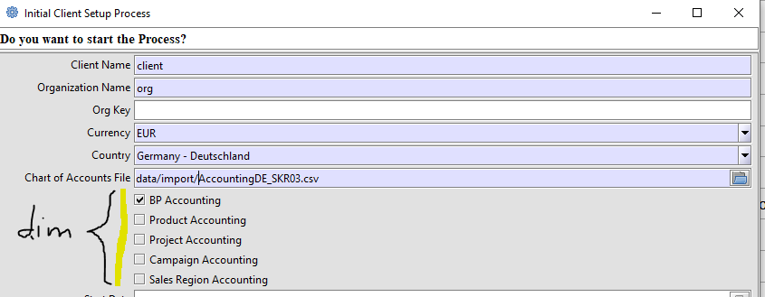
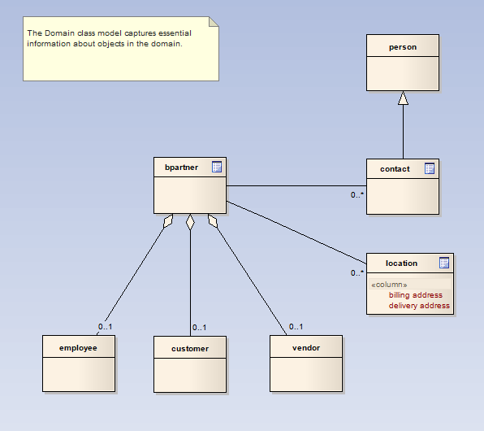
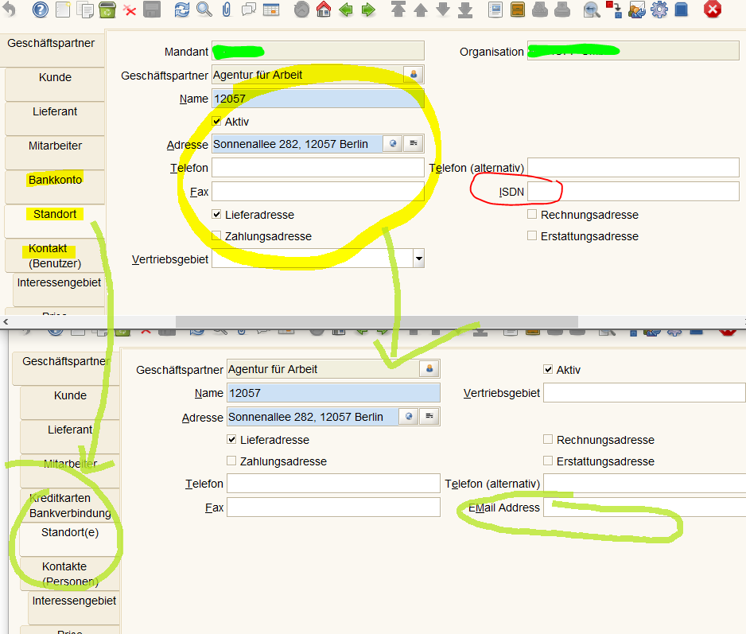
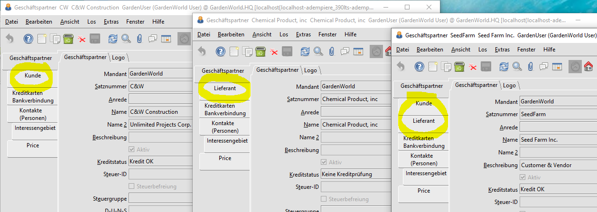
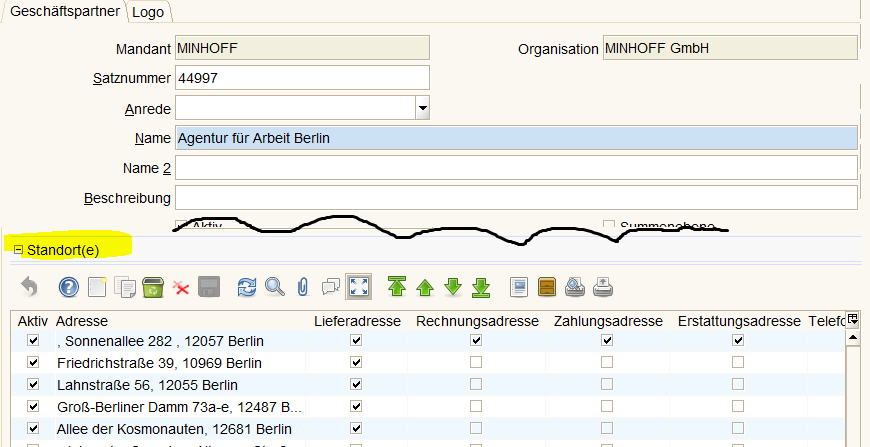

# de-mpiere

de-mpiere steht für eine deutschsprechige Anpassung von ADempiere.

warum ADempiere und nicht iDempiere?

Diese Frage ist berechtigt, zumal iDempiere technologisch weiterentwickelt ist und eine größere Entwicklercommunity hinter sich hat.
Die [Streitigkeiten 2011](https://en.wikipedia.org/wiki/IDempiere#History) zersplitterten die Comumnity in mehrere Lager. Es ging auch um die [Namens- und Logorechte](http://wiki.adempiere.net/Use_of_Adempiere_name) und die [Root Domains](http://wiki.adempiere.net/Use_of_Adempiere_name#Root_Domains). So landet man unter adempiere.com, *.org, usw bei den verschiedenen Protagonisten des Streits, der schliesslich zum neuen Namen iDempiere führte.

Lange Zeit war adempiere.de "verwaist". Erst im August 2017 mit Erscheinen der Version 3.9 präsentiert sich die Seite mit neuem Logo und als Ableger von [adempiere.net](http://www.adempiere.net/). Die domain [adempiere.de](http://metasfresh.com/2009/08/24/metas-stiftet-domain-und-website-an-adempiere-e-v-3/) gehört der [Stiftung (ADempiere e.V)](http://www.adempiere.de/web/guest/kontakt). Der [sourcecode](http://www.adempiere.net/web/guest/sourcecode) ist auf [GitHub](https://github.com/adempiere/adempiere/graphs/contributors) abgelegt. Die Hauptentwickler kommen aus Mittelamerika.

Der Grund für die Wahl von AD390 ist ein Migrationsprojekt [](https://github.com/adempiere/adempiere/pull/1327#issuecomment-328916188). Die Unterschiede zwischen Quelle und AD sind geringer als zwischen Quelle und iD.

* nach der [Installation (en)](http://wiki.adempiere.net/Installation_Steps) von ADempiere V.3.9.0 stellt man fest, dass die Basissprache  `en` ist und die einzige Übersetzungssprache `es_MX` ist - kein Wunder, dort sitzt [der Hauptentwickler](https://github.com/e-Evolution).  

## [Anpassung der Übersetzungssprache](http://wiki.idempiere.org/de/Sprache_(Fenster_ID-106)#Beitr.C3.A4ge)

Wer die Anpassung `mx` nach `de` nicht selber machen will, findet eine Dump für Postgresql [hier](https://github.com/klst-de/de-mpiere/tree/master/data/seed)

im login-Fenster werden immer noch alle Sprachen angezeigt!

* deaktiveren aller nicht benötigten Sprachen per SQL:

```sql
update ad_language set isactive='N'
where not(isbaselanguage='Y' or issystemlanguage='Y')
```

* ...  hilft nicht viel, denn
* in `org.compiere.util.Language` sind die im login-Fenster angezeigten Sprachen statisch definiert

## Einrichtung eines Mandanten mit Standard-Kontenrahmen



Gesetzlich besteht kein [Zwang für die Anwendung eines Kontorahmens](http://wirtschaftslexikon.gabler.de/Archiv/6469/erlasskontenrahmen-v8.html). De facto haben sich [Standardkontenrahmen](https://de.wikipedia.org/wiki/Kontenrahmen#Standardkontenrahmen) als Muster für einen [Kontenplan](https://de.wikipedia.org/wiki/Kontenplan) durchgesetzt

* [Kontenplan](http://wiki.idempiere.org/de/Ersteinrichtung_Mandant#Hinweise_zu_Kontenpl.C3.A4nen)

Beim Einrichten werden die optionalen [Dimensionen für die Buchführung](2.8-acc.md) festgelegt.

## Steuern 

Das [Datenmodell](https://globalqss.com/idempiere/2.1_20141110/schemaspy/Tax/tables/c_tax.html) für Steuern ist recht komplex. Allein die UN/EDIFACT [Liste der Steuerkategorien](http://www.unece.org/trade/untdid/d13b/tred/tred5153.htm) ist recht umfangreich. Für den Anfang sollte man die diversen USt der Kategorie VAT/"Value added tax" mit ihren [Steuersätzen](https://de.wikipedia.org/wiki/Umsatzsteuer#Umsatzsteuer_in_EU-L.C3.A4ndern) anlegen.

## TODO : [Ortsangaben](https://bitbucket.org/eugenh/idempiere/wiki/Orte#!landerspezifische-einstellungen) 

## TODO : [Banken](http://www.adempiere.com/DE/Bank#Beitr.C3.A4ge)

## UI Anpassung am Beispiel Geschäftspartner



* ein Geschäftspartner ist ein Kunde oder ein Lieferant, oder beides. Oder ein Mitarbeiter.
* die Beziehung zu den Unterregistern ist 1:0..1
* das dynamische AD-Layout sollte das Unterregister Kunde nur anzeigen, wenn es sich um einen Kunden handelt
* die Beziehung zum Unterregister Bank ist 1:0..n : ein Geschäftspartner hat keine oder mehrere Bankverbindungen hinterlegt
* ebenso die Unterregister Kontakte und Standorte : ein Geschäftspartner kann mehrere Standorte haben

Im folgenden Beispiel werden
* die Benennungen der Register angepasst, um den Charakter des Registers gerecht zu werden. Es gibt mehrere Standorte.
* die "veraltete" Information ISDN wird durch `eMail` ersetzt
* das Layout wird etwas verändert
  * Felder `Mandant` und `Organisation` sind redundant und nicht notwendig
  * Felder mit Bezug zu Adresse wurden dorthin gruppiert



### conditional Tab

Ist ein Geschäftspartner ein Kunde, so ist es sinnvoll die Tabs Lieferant und Mitarbeiter dynamisch auszublenden:



### embedded Tab

Im zweiten Schritt wird das Register `Standorte` als ein "embedded Tab" definiert, so dass alle Standortattribute als Einzelzeilen sichtbar sind



embedded Tabs werden auch an anderen Stellen verwendet. In [Angeboten und Aufträgen](2.3-sales.md) zum Anzeigen der Auftragsposten. In Bestellungen, Lieferscheinen und Rechnungen.