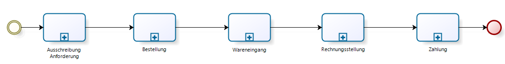
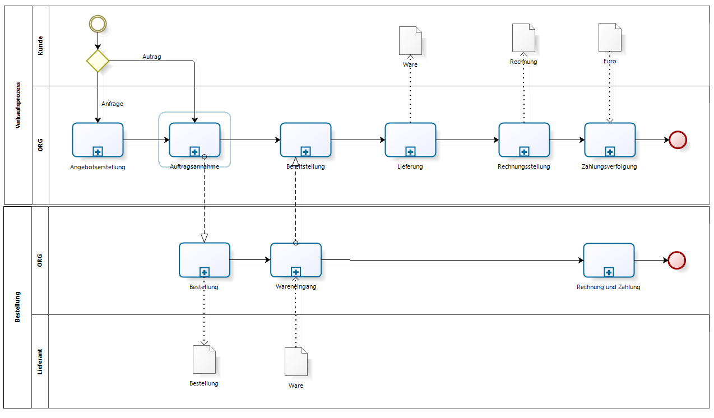

## Beschaffungsprozess / Einkauf

Es gibt eine Symetrie zwischen Vertriebsprozess und Beschaffungsprozess:

Allerdings spiegelt sich das nicht im Adempiere Menü "Beschaffung" wieder:

Manchmal ist der Vertriebsprozess mit dem Beschaffungsprozess verzahnt. Ware wird erst nach Auftragseingang bestellt. Das verzögert die Auslieferung an den Kunden, aber es minimiert die Lagerkosten. Oft findet man eine Kombination. Häufig benötigte Ware wird in Chargen bestellt oder produziert und zwischengelagert. Andere Artikel werden erst bei Auftragseingang hergestellt (make-to-order). 

Eine andere Variante ist das [Streckengeschäft](https://klst-de.github.io/de-mpiere/4.opentrans.html).