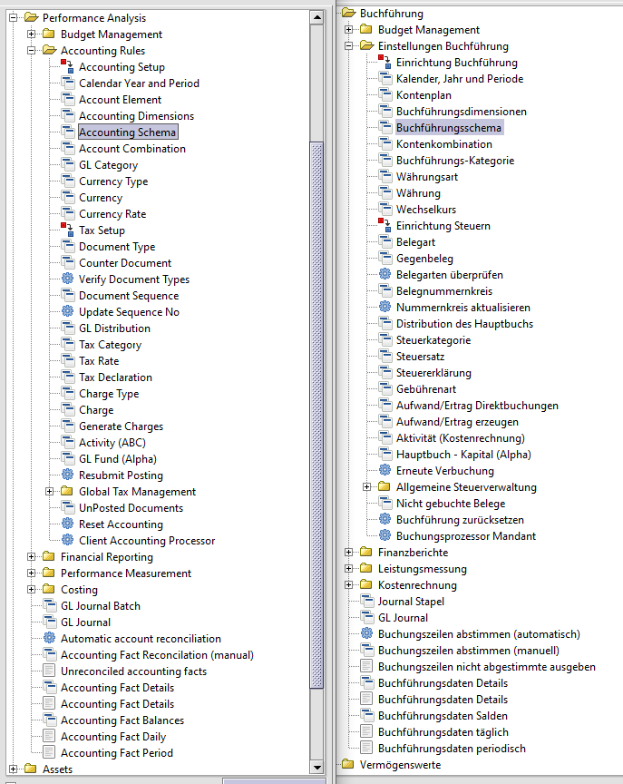

## Rechnungswesen / Buchführung

Buchführung vs Buchhaltung

[Buchführung](https://de.wikipedia.org/wiki/Buchf%C3%BChrung) bezeichnet die in Zahlenwerten vorgenommene Aufzeichnung von Geschäftsvorgängen. [Buchhaltung](https://de.wikipedia.org/wiki/Buchhaltung) ist die Organisationseinheit eines Unternehmens, die sich mit der Buchführung befasst. Häufig werden die Begriffe Buchhaltung und Buchführung als Tätigkeit synonym verwendet.
[Rechnungswesen](https://de.wikipedia.org/wiki/Rechnungswesen) ist ein umfassendere Begriff zur Buchführung.

Das Benutzermenü in Adempiere hat einen Abschnitt für die "Einstellung der Buchführung":

Die zentralen Punkte bei der Einstellung sind
* die Definition eines Buchungskalenders für die Geschäftsjahre mit Buchungsperioden
* der Kontenplan, also ein Kontorahmen
* das Buchführungsschema mit Dimensionen und Zuordnung der [Basiskonten](http://wiki.idempiere.org/de/Basiskonten) zum gewählten Kontenplan
* die Buchführungskategorien
* Festlegen der Belegnummernkreise
* und die Belegarten

Die [AD-Buchungsmaschine/Accounting](http://wiki.idempiere.org/en/IDempiere_Accounting) arbeitet mit "abstrakten" [Basiskonten](http://wiki.idempiere.org/de/Basiskonten), die einem realen Kontenplan, z.B. SKR03 zugeordnet werden. Es gibt zwei feste Dimensionen "Organisation" und "Konto" und weitere optionale für Vertriebsgebiet, Aktivität, Projekt, Geschäftspartner, Artikel und Kampagne. 

Beispiel: die [Zuordnung](http://wiki.idempiere.org/de/Buchf%C3%BChrungsschema_(Fenster_ID-125)#TAB:_Voreinstellungen) der Bank-Basiskonten zum Kontenplan sieht bei drei Dimensionen sieht so aus:

Die [Dimensionen](http://wiki.idempiere.org/en/Accounting_Dimensions_(Window_ID-283)) werden durch ``-`` getrennt. Lesart: das Basiskonto ``b_asset_acct`` ist für alle Organisation ``*`` dem Konto ``1200`` zugeordent. Es gibt 83 solcher Kontenkombinationen. Die Kombinationen werden beim [Einrichten eines Mandanten](1.de-mpiere.md) automatisch erstellt.

Mittelständige Organisationen verzichten oft auf eine Buchhaltung und lassen die Buchführung oder Teile davon (Finanzbuchhaltung) von [externen](https://forum.metasfresh.org/t/bestellung-wareneingang-ent-karottisieren-kein-gemuese/479/6) Unternehmen ([Steuerberater](https://de.wikipedia.org/wiki/Steuerberater)) durchführen. Diese nutzen die [DATEV](https://de.wikipedia.org/wiki/DATEV)-Buchführungssoftware. Dementsprechend steht DATEV auch als Synonym für einen deutschen Standard in der Buchführung.

Teilbereiche der Buchhaltung

### Finanzbuchhaltung

Die [Finanzbuchhaltung](https://de.wikipedia.org/wiki/Finanzbuchhaltung) bucht Vorgänge, die zur Bilanzierung und zur Gewinn- und Verlustrechnung notwendig sind. 
Teilbereiche der Finanzbuchhaltung sind 
* die [Debitorenbuchhaltung](https://de.wikipedia.org/wiki/Debitorenbuchhaltung): verarbeitet die Forderungen an Kunden
* und die [Kreditorenbuchhaltung](https://de.wikipedia.org/wiki/Kreditorenbuchhaltung), welche die Verbindlichkeiten gegenüber Lieferanten bearbeitet

Oft wird die Finanzbuchhaltung ausgelagert und mit DATEV-Software verarbeitet 

### [Offene Posten](https://de.wikipedia.org/wiki/Offener_Posten)

Im [ADempiere Menü](2.de-menu.md) sucht man vergeblich nach den Begriffen Finanz-, Debitoren- oder Kreditorenbuchhaltung. Die Funktionen dazu findet man unter **Offene Posten**

### Anlagenbuchhaltung
  
Die [Anlagenbuchhaltung](https://de.wikipedia.org/wiki/Anlagenbuchhaltung) verwaltet Güter des Anlagevermögens

### Lohnbuchhaltung

Die [Lohnbuchhaltung](https://de.wikipedia.org/wiki/Lohnbuchhaltung) wickelt die Lohn- und Gehaltsabrechnungen ab.

### Kostenrechnung

Die [Kosten- und Leistungsrechnung](https://de.wikipedia.org/wiki/Kosten-_und_Leistungsrechnung) ordnet zu, welche Kosten die einzelnen Unternehmensteile oder Projekte verursachen.

### Lager- oder Mengenbuchhaltung

Die Lager- oder Mengenbuchhaltung ist für die Verbuchung von Geschäftsvorfällen in der [Materialwirtschaft](https://de.wikipedia.org/wiki/Materialwirtschaft) zuständig.
