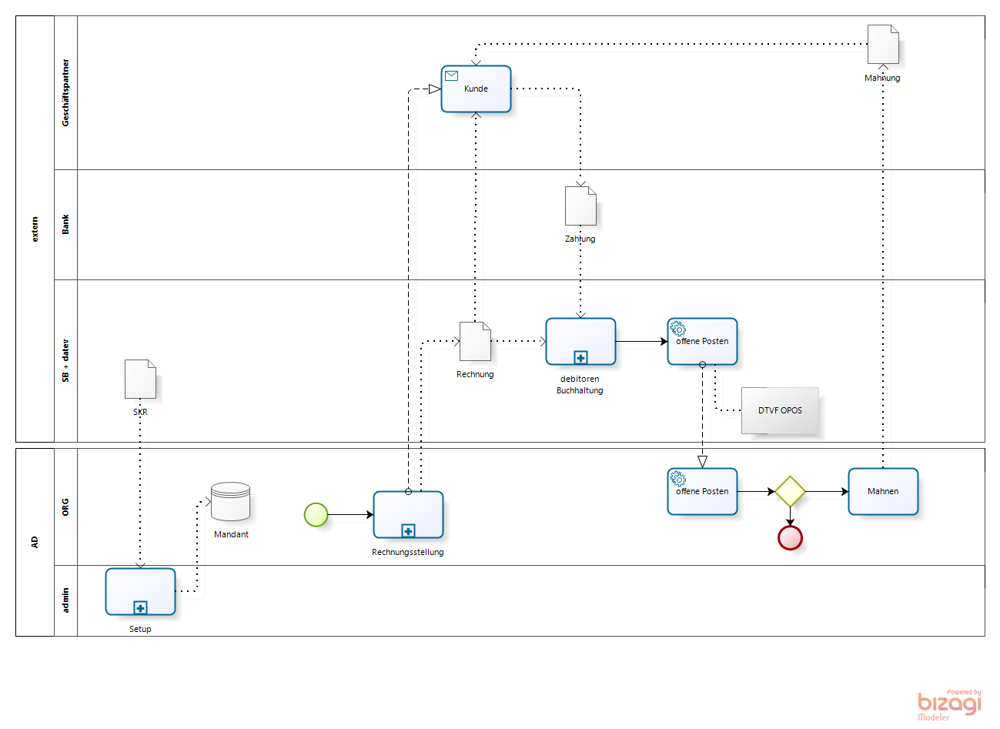

## Koexistenz mit DATEV

Mittelständige Organisationen verzichten oft auf eine Buchhaltung und lassen die [Buchführung](2.8-acc.md) extern durchführen. 
Der Grund für diese Entscheidung liegt in der Tatsache, daß es kaum [Buchhalter](https://de.wikipedia.org/wiki/Buchhalter) gibt, die sich mit *dempiere, auskennen. Und [Wirtschaftsprüfer](https://de.wikipedia.org/wiki/Wirtschaftspr%C3%BCfer) erst recht nicht. Da ist die Dominanz aus [Nürnberg](https://de.wikipedia.org/wiki/DATEV) und [Walldorf](https://de.wikipedia.org/wiki/SAP) zu groß. Schade eigentlich.

Die Entscheidung, die Buchhaltung mit [DATEV](https://de.wikipedia.org/wiki/DATEV)-Buchführungssoftware durchzuführen, betrifft einige [Geschäftsprozesse](2.de-menu.md). Es fängt schon bei der Einrichtung eines Mandanten in ADempiere an. Die folgende Abbildung zeigt zwei Beispiele

* die Wahl eines Kontorahmens bei der Einrichtung eines Mandanten in ADempiere
* die Synchronisierung der debitoren Bewegungsdaten 

 

### Einrichtung eines Mandanten mit Standard-Kontenrahmen

Schon früh muss man sich für einen [Kontenrahmen](https://de.wikipedia.org/wiki/Kontenrahmen#Kontenklassenbeispiele) entscheiden. Was ist der [Unterschied zwischen SKR03 und SKR04](https://www.teialehrbuch.de/Kostenlose-Kurse/Rechnungswesen-mit-Beispielen-aus-Lexware-und-DATEV/11.5.2-Die-Kontenrahmen.html)? Kurz:

* SKR03 ist nach dem Prozessgliederungsprinzip aufgebaut
* SKR04 ist nach dem Abschlussgliederungsprinzip aufgebaut

### Suchschlüssel für Geschäftspartner

In beiden Kontenrahmen werden für Personenkonten die folgenden Nummerkreise vorgeschlagen:

    10000-69999 : Debitoren
    70000-99999 : Kreditoren

Dieser Vorschlag sieht nicht vor, dass ein Geschäftspartner gleichzeitig Kunde und Lieferant ist. In solchen Fällen werden zwei Konti eingerichtet.
Um Geschäftspartnerstammdaten in ADempiere und DATEV synchron zu halten, kann man den Nummer der Personenkontos als Suchschlüssel für einen ADempiere Geschäftspartner verwenden. Daraus folgt, dass auch in ADempiere zwei GP eingerichtet werden müssen, wenn ein Partner sowohl Kunde wie auch Lieferant ist.

### Stammdatenpflege

Mit der Entscheidung neben ADempiere eine weitere Buchführungssoftware zu nutzer, die ebenfalls Stammdaten benötigt, müssen die Geschäftspartnerstammdaten synchronisiert werden. Man sollte ein System zum Lead definieren. Ist ADempiere das Leadsystem, dann werden nach einem initalem Befüllen der Stammdaten ins DATEV nur die Veränderungen (Zugänge, Deaktivierungen und Änderungen) periodisch übertragen.

#### DTVF

DTVF steht für DaTeV-Format. Unter [diesem Link](https://www.datev.de/dnlexom/client/app/index.html#/document/1036228) findet man eine Beschreibung der DTVF ASCII-Dateien zum Export und Import von Stamm- und Bewegungsdaten in ein DATEV Rechnungswesen-Programm.

### Synchronisierung der debitoren Bewegungsdaten 

Die Abbildung oben zeigt die letzten Subprozesse vom [Vertriebsprozess](2.de-menu.md), die Rechnungstellung und Zahlungsverfolgung ist aufgezoomt. In der ADempiere Rechnungsstellung wird dem Kunden eine Rechnung zugestellt. 

Die [Finanzbuchhaltung und die Offene Posten Verwaltung](https://de.wikipedia.org/wiki/Debitorenbuchhaltung) wird extern via DATEV erledigt. Dafür müssen Rechnung, Rechnungsdaten dem Steuerberater als DTVF-Buchungsstapel bereitgestellt werden. Die Zahlungseingänge fliessen in die Offene Posten Verwaltung. Die Ergebnisse, eine Liste von abgeglichenen Rechnungen und Zahlungen im DATEV Jargon OPOS-Liste genannt, können in die ADempiere Offene Posten Verwaltung zurückfliessen. Für die verbliebenen nicht beglichenen Rechnungen wird ein Mahnlauf durchgeführt.

### Synchronisierung der kreditoren Bewegungsdaten 

