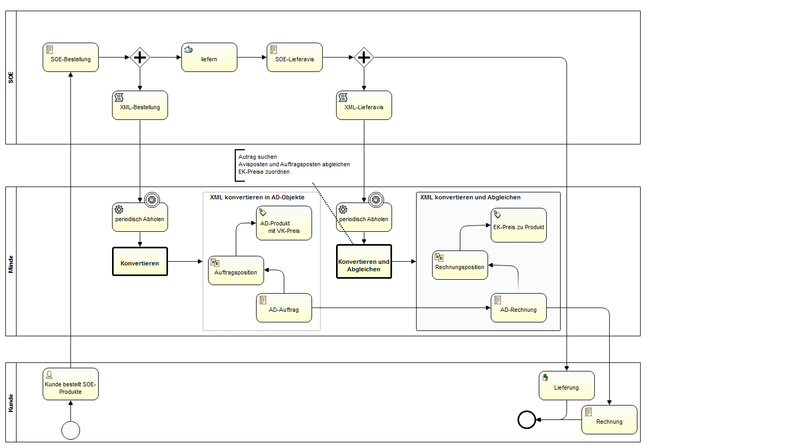

## Nutzung von openTRANS

[openTRANS](https://de.wikipedia.org/wiki/OpenTRANS) ist ein offener XML-Standard entwickelt auf Initiative des Fraunhofer IAO zur Unterstützung des elektronischen Datenaustauschs (EDI) bei Geschäftstransaktionen zwischen Handelsunternehmen.

Im konkretem Fall zeige ich anhand eines Geschäftsprozesses ([Streckengeschäft](https://de.wikipedia.org/wiki/Streckengesch%C3%A4ft)) die Nutzung von openTrans im ADempiere-Umfeld. Das folgende [BPML](https://de.wikipedia.org/wiki/Business_Process_Model_and_Notation#Version_2.0) Diagramm zeigt drei Geschäftspartner (Aktoren)

- in der mittleren [Bahn](https://de.wikipedia.org/wiki/Business_Process_Model_and_Notation#Pools_und_Swimlanes_.28Schwimmbahnen.29) unsere Firma, die ADempiere einsetzt
- unten ein Kunde, der per Internet oder Katalog Waren bei uns kauft
- oben die Firma SOE, unserer Streckengeschäftspartner der das WEB-Geschäft abwickelt. SOE ist für den Kunden nicht sichtbar. SOE kommuniziert mit uns per openTRANS.



In dem dargestellten Geschäftsfall 
- bestellt ein Kunde SOE-Produkte auf der unserer Website 
- SOE bereitet die Lieferung vor
- und sendet eine openTRANS-ORDER Nachricht zu uns

Typischerweise fallen mehrere Nachrichten dieser Art täglich an. Sie werden periodisch abgeholt und müssen in das ERP-System eingespeist werden. Im ersten Schritt wird das Konvertieren der openTRANS-ORDER Nachrichten implementiert, um Adempiere-Order zu erzeugen.

Da im Streckengeschäft die Produkte bei uns nicht lagerhaltig sind, sind sie auch nicht zwangsläufig im ADempiere erfasst. Erst durch die ORDER Nachricht muss das Produkt mit all seinen Artikel-Bestandteilen angelegt werden:
- [Maßeinheiten](http://wiki.idempiere.org/de/Ma%C3%9Feinheit_(Fenster_ID-120)): der Kunde hat drei "Six pack" Bier geordert. Die Maßeinheit "Six pack"-P6 muss im System definiert sein.
- Preise: um die Rechnung auszustellen, werden im ADempiere die aktuellen Preise benötigt
- Steuern
- und natürlich das Produkt selber

Im ersten Implementierungsschritt werden alle Methoden implementiert, die zum Produktumfeld gehören. In Folgeschritten wird der Auftrag mit seinen Positionen und das Abhandeln der Lieferavis implementiert.

### OpenTRANS nach ADempiere

Wie geschieht das Mapping der OpenTRANS-Objekte in adempiere-Objekte?

Dieser Transformation geschieht in zwei Schritten

- standard JAXB-[unmarshaller](http://www.devx.com/Java/Article/34069), daraus entstehen [openTRANS-ORDER pojo's](https://de.wikipedia.org/wiki/Plain_Old_Java_Object) in Methode `Transformer.toModel(...)` in package `com.klst.opentrans` 
- Mapping openTRANS-pojo nach adempiere-Objekte

Beispiel: diese Methode liest ein xml-openTRANS-ORDER und liefert die pojo Klasse ORDER
```java
	protected ORDER unmarshal(String uri) {
		ORDER order = null;
		OPENTRANS ot;
		try {
			File file = new File(uri);
			InputStream is = new FileInputStream(file);
			ot = transformer.toModel(is);
			order = ot.getORDER();
		} catch ...
		return order;
	}
```

### Grober Aufbau einer OpenTRANS-Order

Die Details kann man im xsd-file nachlesen, welches sich im opentrans.jar befindet. ORDER besteht aus 1 bis n ORDER_ITEMs, die detailieter beschrieben werden:
```xml
<OPENTRANS>
   <ORDER type="standard"  ... >
      <ORDER_HEADER>
         <ORDER_INFO>
            <ORDER_ID>8566</ORDER_ID>
...
      <ORDER_ITEM_LIST>
         <ORDER_ITEM>
            <LINE_ITEM_ID>1</LINE_ITEM_ID>
            <PRODUCT_ID>
               <bmecat:SUPPLIER_PID>302208250</bmecat:SUPPLIER_PID>
               <bmecat:BUYER_PID type="BZRNR"/>
               <bmecat:DESCRIPTION_SHORT>Schneider Kugelschreiber K20 Icy</bmecat:DESCRIPTION_SHORT>
            </PRODUCT_ID>
            <QUANTITY>40</QUANTITY>
            <bmecat:ORDER_UNIT>PCE</bmecat:ORDER_UNIT>
            <PRODUCT_PRICE_FIX> ...
...
         </ORDER_ITEM>
...
```
Die openTRANS-pojos werden in folgende adempiere-Objekte abgebildet:

-    ORDER -> MOrder
-    ITEM -> MOrderLine
-    PRODUCT_ID -> MProduct , dabei werden bei Bedarf neue Produkte angelegt
-    ORDER_UNIT -> MUoM, der oben erwähnte "Six pack", oder PCE im xml-Beispiel
- ...
