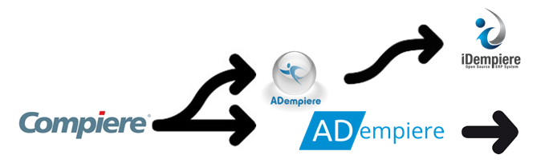

[Ade-mpiere](https://github.com/klst-de/adempiere) is a [fork](https://en.wikipedia.org/wiki/Fork_(software_development)) of  [adempiere](https://github.com/adempiere/adempiere)-repo, one of the children of [Compiere ERP system](https://en.wikipedia.org/wiki/Compiere) which was developed in the late 90th

# [History](https://en.wikipedia.org/wiki/IDempiere#History)

* [ADempiere.net (en)](https://klst-de.github.io/adempiere/) : is *.net the official(!) successor of Compiere?
* [ADempiere.org (en)](http://adempiere.org/site/) : or is this the official(!) page of the successor of [Compiere](http://www.compiere.com/company/history.php)?
* [IDempiere](https://en.wikipedia.org/wiki/IDempiere) : [iDempiere](http://www.idempiere.org/) is a grandchild of [Compiere](http://www.compiere.com/svn/)

# de-mpiere
